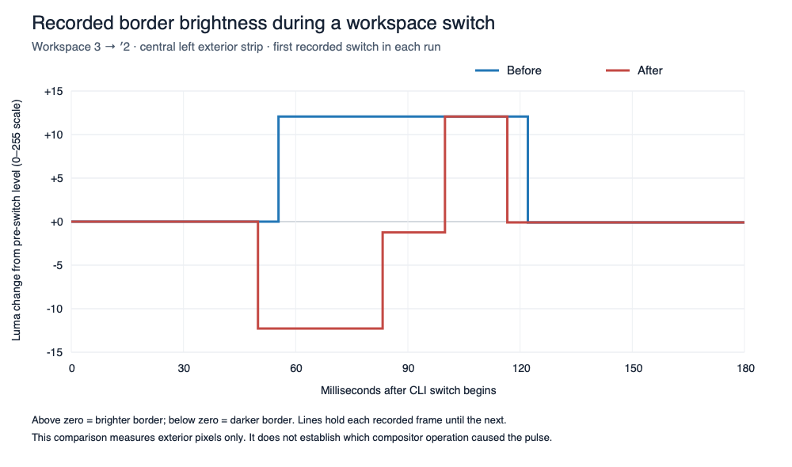

# Native window hiding investigation

Checked on 2026-09-29, on macOS 26.5.1 (25F80), with one Studio Display and one
normal macOS desktop. `csrutil status` reported SIP enabled before and after the
tests.

## Result

Actual per-window hiding works on this machine without disabling SIP. Both
existing private-API implementations removed a disposable window from
WindowServer's on-screen list and restored it without changing its frame.

This establishes feasibility, not a fix for the previous integrated AeroSpace
hover regression. The isolated AppKit test did **not** reproduce that regression.
The installed AeroSpace process and its configuration were left unchanged during
the isolated tests. A subsequent live trial is recorded below.

## What was tested

A separate accessory AppKit process owned a borderless floating window with an
`NSTrackingArea` using `activeAlways`. An external controller, compiled against
the repository's `WorkspaceVisibility.m` and `WorkspaceGroups.m`, moved that
window. AeroSpace did not manage the probe. This isolates the private APIs from
AeroSpace's refresh, activation, and focus scheduling.

| Method | While hidden | After reveal | Hover evidence |
| --- | --- | --- | --- |
| Connection-owned group | Only type-3 group membership; not on screen | Same group; on screen; `isOnActiveSpace == false` | Real pointer movement increased the counter from 133 to 185, with two additional enter/exit pairs, while the group was shown |
| Normal native parking Space | Only parking desktop membership; not on screen | Only original desktop membership; on screen; `isOnActiveSpace == true` | Hover worked after restoration to the original desktop |

The false `isOnActiveSpace` value in the group approach is a compatibility
difference, but it does **not** by itself explain the old hover failure. The
probe continued receiving mouse events in that state. Tracking that depends on
the active app or key window, browser hover, and AeroSpace's focus integration
were not covered by this test.

Additional checks:

- Five automated hide/reveal/restore cycles for each method: all ten passed
  visibility, restored membership, and unchanged-frame assertions.
- Killing the controller while its group was hidden returned the probe to the
  original desktop and made it visible. This verifies that specific
  connection-loss case, not AeroSpace's complete crash recovery.
- A hybrid experiment assigned the window to a hidden group and then called
  `AeroSpaceMoveWindowsToNativeSpace(home)`. Membership became `[group, home]`:
  that call does not detach a type-3 group. Destroying the group removed the
  remaining membership.
- Cleanup removed the probe process and window. The desktop inventory returned
  to its original single desktop; the original AeroSpace process was still
  running.

Probe sources and raw results from this session are in the ignored directory
`.local/native-hiding-investigation/`, including `verification.json` and
`group-confirmation.log`.

## First integration trial design

Start with normal native parking and public focus. That keeps visible windows
on the normal desktop and separates hiding from the experimental early private
activation path. The diagnostic flags for that combination are
`AEROSPACE_NATIVE_WORKSPACE_VISIBILITY=1`, `AEROSPACE_WORKSPACE_GROUPS=0`, and
`AEROSPACE_PRIVATE_FOCUS=0`.

Before enabling this for daily use, test actual AeroSpace workspace switches,
key-window tracking, Zen/Chromium hover, multiple windows of one app, dialogs,
minimization, app activation, and recovery. Both existing backends currently
require one display and one normal desktop before starting; the parking backend
creates its own additional desktop.

Code review also found two paths that need regression tests before relying on
the integration:

- `NativeVisibilityWorker.apply` queues a retired live window back to the home
  desktop, but removes its entry without waiting for that restoration.
- `WorkspaceGroupVisibilityWorker.apply` can return its inactive plan after
  assignments when the prepared focus job is cancelled, without first restoring
  group membership.

The prior hover regression is recorded in commit `6216c2d5`. Independent evidence
for SIP-enabled normal-Space moves is in
[yabai issue #2788](https://github.com/asmvik/yabai/issues/2788).

## Live native-parking trial

The user subsequently requested a trial of normal native parking with public
focus handling. The installed build (`dbe8ec6e`) already contains these options;
no rebuild, installation, or persistent configuration change was required.

The trial saved all five existing window/workspace assignments and layouts,
quit AeroSpace normally, and relaunched the same installed app with the three
flags above. It restored all five assignments and the checkpoint's focused
window. This created one additional normal macOS desktop for parked windows.

Six CLI workspace selections spanning all five occupied workspaces passed:
WindowServer reported every inactive window off screen and the active
workspace's window on screen. The original desktop stayed active throughout.
SIP remained enabled. The user then confirmed that the corner slivers were gone
and input worked normally after being asked to check workspace switching,
hover, scrolling, and typing, particularly in Zen. A subsequent snapshot showed
Zen on screen and the other four managed windows fully hidden.

The native-parking/public-focus combination was left active for that launch.
This successful trial does not isolate whether the earlier regression came from
group visibility, private focus, or their interaction, and does not cover all
window lifecycle and recovery cases listed above.

Trial scripts, launch logs, assignment checkpoint, and `switch-checks.json` are
in `.local/native-hiding-investigation/runtime/`. During that environment-only
trial, this command returned to the usual mode while preserving assignments:

```sh
python3 .local/native-hiding-investigation/runtime/trial.py restore
```

Those environment options affected only that launch. The later config-controlled
implementation below is persistent; the old `trial.py restore` command does not
disable its config option.

## User entered and closed the parking desktop

The user reported entering the extra desktop, seeing a black screen, and closing
it in Mission Control. Corner slivers did not return.

Read-only inspection afterward found that the original parking Space (`7292`)
had been replaced by a new owned parking Space (`7295`) in the same AeroSpace
process. WindowServer still reported the home desktop plus that parking Space,
although the user no longer saw another desktop in Mission Control. All five
windows retained their workspace assignments: the current workspace's window
was on the home desktop, and the other four were off screen in the new parking
Space. See `runtime/after-user-closed-space.json` for the snapshot.

This matches the automatic restart path: after recovery returns the topology
to one normal desktop, `start()` can create a new parking Space. Corner fallback
is therefore not necessarily persistent or visibly observable. The black screen
and Mission Control's presentation were not recorded, so their precise cause
remains unverified.

## Deliberately hidden parking prototype

The current type-0 parking constructor does not request exclusion from Mission
Control. Its replacement disappearing from that UI is not a verified hiding
contract. Also, the live backend requires exactly home plus parking: adding
another user desktop deliberately triggers recovery, explaining the repeated
cleanup/recreation behavior.

A separate prototype instead used a never-shown connection-owned type-3 group
only for inactive windows. Visible windows returned exclusively to the ordinary
home desktop using `SLSBridgedSpaceAddWindowsAndRemoveFromSpacesOperation` with
`options:15`. This avoids the `[group, home]` membership left by a normal managed
Space move, and differs from the older group backend, which renders visible
windows inside shown type-3 groups.

Five cycles passed on a disposable window owned by a separate process, with SIP
enabled:

- Hidden: membership exactly `[group]`, absent from the on-screen window list.
- Revealed: membership exactly `[home]`, present in the on-screen window list.
- The normal desktop list stayed unchanged throughout creation, hiding,
  revealing, and cleanup. No extra managed desktop was created by the probe.
- The window's frame was unchanged, and cleanup removed the group.

The first probe run correctly restored the window but failed its visibility
assertion because offscreen window records omit the optional
`kCGWindowIsOnscreen` key. The corrected probe explicitly checks the on-screen
window list instead of interpreting that missing key as a query failure.

Sources and results are in
`.local/native-hiding-investigation/hidden-parking/`, particularly
`HiddenParking.m` and `result-verified.jsonl`. The probe window was closed after
verification. The existing live AeroSpace trial was not restarted or replaced.

This established a way to park without creating a normal desktop from startup.
The isolated prototype did not verify AeroSpace integration, browser input, native fullscreen,
user-created desktop transitions, or complete crash recovery for this design.
Direct inspection of Mission Control via Computer Use timed out; absence from
its normal desktop inventory was verified through WindowServer instead.

## Config-controlled implementation

`enable-native-window-hiding = true` selects `HiddenWindowParkingWorker`.
The default remains false. This backend parks only inactive windows in a single
never-shown connection-owned group. It confirms exclusive home membership before
releasing visible windows for AX frame writes and public focus. It overrides the
older environment-variable experiments and does not use their private focus path.

Adding another ordinary desktop does not recreate parking. Leaving home restores
the parked windows and suspends positioning/focus until home becomes active again.
If home is deleted, recovery uses an existing normal desktop before reanchoring.
Known windows moved to other native desktops retain their AeroSpace assignment in
a separate container and leave no empty tile. They return to their original tiling
or floating state only after positive membership confirmation. Newly discovered
foreign windows are not imported. Corner fallback and shutdown also respect
foreign membership; failed cleanup does not permit shutdown frame writes.

Automated coverage includes same-app windows, superseded/cancelled requests,
retired/closed windows, owner ID reuse, missing queries, partial failure,
foreign desktops, native fullscreen suspension, deleting home, and explicit
disable/re-enable. Full `./test.sh` passes with warnings as errors, formatting,
SwiftLint, Periphery, and generated-source consistency checks. The production C
return operation also passed five isolated live cycles and 21 mocked cases.

The supported configuration is one monitor. Private APIs remain subject to macOS
changes; absent APIs fall back to ordinary corner hiding.

### Refresh cancellation during workspace switches

Workspace commands cancel background refreshes. Previously, cancellation during
`HiddenWindowParkingWorker.apply` restored the entire hidden group, briefly
revealing unrelated workspaces before the next layout parked them again. This
could happen even during a refresh with no membership changes.

An already-started synchronous transition now finishes its membership operations
and validation, retaining every tracked window. Cancellation invalidates new and
stale frame/focus gates; the next request reconciles the observed memberships on
the same actor. An unchanged, previously published gate remains valid after its
membership and active home are verified. Cancelling that gate during a no-op
refresh could discard an activation still queued against it; publishing a fresh
gate in the next refresh did not rescue the queued job. The caller therefore
also leaves gate cancellation to the hidden-parking worker.
Actual driver failures, desktop changes, and explicit shutdown still
use recovery. Regression tests interrupt queries, creation, reveal, hide, and
final verification, and cover pending activation, subsequent requests, native
desktop changes during a no-op refresh, and retirement of newly parked windows.
These tests verify the state-machine races. The pixel trace below isolated the
remaining presentation issue after those fixes.

### Captured wallpaper frames

A manual trace on build `0722c21c` captured 19 wallpaper flashes during 323
Option-key workspace selections between Zen (workspace 1) and fullscreen Ghostty
over FaceTime (workspace 2). Sixteen lasted one 60 Hz frame and three lasted two.
The user confirmed seeing the flash during this trace. There was no corresponding
logical workspace reversal.

The anomalous frames matched a desktop-only ScreenCaptureKit reference: the RMS
difference across a 16-by-9 RGB grid was 0.173 on the 0–255 scale. Only numeric
frame fingerprints were retained. This identifies wallpaper appearing between
the outgoing and incoming windows, rather than another workspace being selected.
Replaying 120 of the user's actual shortcut timings while keeping Option held
reproduced eight wallpaper flashes. The earlier individually released shortcuts
and membership checks had missed this behavior.

A disposable cross-process experiment tested combining the two moves with
`SLSTransactionAddWindowToSpaceAndRemoveFromSpaces`. The existing bridged move
succeeded, but the direct transaction did not change either membership with SIP
enabled. Both fixture windows were restored and removed; user windows were
unchanged. Inspection showed that the working bridged operation executes its
fallback in WindowManager's process, unlike a transaction on AeroSpace's own
connection. The higher-level WM transaction API uses app-scoped window UUIDs;
no working cross-app batching route was established.

The accepted change waits for all revealed windows to appear in WindowServer's
on-screen list before hiding outgoing windows. It polls at 4 ms intervals with a
250 ms budget and retains the final active-desktop validation. Missing visibility
queries, timeout, and cancellation remain bounded. Public focus and frame gates
still open only after the outgoing hide; this does not restore the rejected
early-focus handoff.

Signed build `e908ebc7` passed all 610 Swift tests and the release build. Replaying
the same 120 shortcut timings produced zero wallpaper flashes across 1,640
captured display updates, versus eight before the change. No logical workspace,
native focus, or classified display-content reversal was observed. An earlier
partial run also had zero flashes across 86 shortcuts but is not used as the
matched comparison. These captures establish the improvement for this sequence;
on-screen metadata still is not a general presentation fence.

Installation preserved seven window assignments, frames, Ghostty's fullscreen
state, focus, and unchanged config. The restoration helper needed to restore
FaceTime from its configured floating default to tiling, infer its equal split
from its right-side position because the app constrains its size, and focus the
saved fullscreen window before leaving its workspace. Exact saved-frame checks
were retained. The first installation attempt restored the previous binary;
after the helper was corrected, the original layout was verified before retrying.

Raw fingerprints, the desktop reference, keyboard replay, and isolated probe
results are retained locally under `.local/remaining-flash/`.

## Installed verification

Built and installed signed universal app/CLI snapshot `17e9ae53` with the existing
certificate, then enabled the config option in `~/.aerospace.toml`. The install
restored six window assignments, the existing two-window Zen split, its full-width
AeroSpace fullscreen state, and focus. The previous managed parking desktop was
removed during graceful shutdown. No accessibility reapproval or SIP change was
needed.

- Ten workspace selections passed on the user's windows: visible windows had
  exclusive home membership; inactive windows shared one offscreen group; the
  managed desktop list remained just the original desktop.
- Disabling and re-enabling the option through config reload restored every
  window to home and then reinstated hiding, without creating another desktop.
- A regular disposable AppKit app had two windows on separate AeroSpace
  workspaces. Both received real pointer movement and text entry. The user
  confirmed that typing and other input worked normally.
- Native fullscreen stayed active without AeroSpace pulling the desktop back.
  Exiting fullscreen restored home membership and normal workspace hiding.
- Minimizing one test window preserved independent visibility of the other.
  Closing the revealed window and terminating the probe completed normally.
  The probe was removed and the user's workspace/focus restored.
- Inspection after probe cleanup found all six user windows still registered with correct
  current-workspace visibility, one ordinary desktop, and SIP enabled.
  A later snapshot had five remaining windows, again with correct visibility.

The user also confirmed that parking was absent from Mission Control and that
adding an ordinary desktop, switching to it, and returning behaved normally.
They observed that AeroSpace workspace commands had no visible effect on the
other native desktop, consistent with suspended positioning/focus. Native
fullscreen transitions were checked live as described above; deleting the home
desktop is covered by the state-machine tests rather than a live destructive test.
Forcibly removing the hidden parking group while AeroSpace is running has not
been tested; successful cleanup/recreation does not establish that exact case.

Raw checks are under `.local/native-hiding-investigation/installation/` and
`two-window-probe/`. Full build/check logs are in `build-logs/`. The app, CLI,
config, and window checkpoint are retained under `installation/checkpoints/`;
`installation/latest.json` identifies the successful install checkpoint.

To disable the new backend, set `enable-native-window-hiding = false` and run
`aerospace reload-config`. This recovery path was checked live. The local
`installation/manage.py rollback --mode native-trial` helper can also restore
the prior installed build and its environment-only trial; `--mode normal`
restores the prior build using ordinary corner hiding.

## Rejected shadow-handoff trial (2026-09-29)

A staged reveal/focus/hide implementation was tested in isolated build
`7bf9d3f3`. It restored incoming windows home, released their frame/focus gates,
and retained outgoing windows while an asynchronous handoff observed completed
frame/focus jobs, the destination's frontmost app/window and stable geometry.
The presentation opportunity was 17 ms, bounded by 200 ms from the original
request. Request IDs and a synchronously cancelled focus-change ticket protected
against stale hides; the final hide rechecked owners and desktop memberships.
Full `./test.sh` and the signed universal release build passed, including new
staging, cancellation, ownership, recovery and presentation-readiness tests.

The live visual comparison rejected this approach. Six switches between the same
two single-window workspaces were recorded before and after. The baseline was
repeated after rollback using the same direct-app AX queries and sampling path
as the trial; focus readback succeeded in every sample in both matched runs.
Only exterior border strips were retained. Baseline bright pulses lasted roughly
33–67 ms. The trial shortened some bright pulses but added dark pulses lasting
roughly 50–67 ms:

| Exterior strip | Baseline peak bright overshoot | Trial peak bright overshoot | Trial peak dark undershoot |
| --- | ---: | ---: | ---: |
| Left | 12.16 | 12.07 | 12.24 |
| Right | 6.85 | 6.75 | 6.90 |
| Top | 1.58 | 1.58 | 4.28 |

Values are encoded luma units on a 0–255 scale, relative to stable surrounding
frames; baseline dark undershoot was zero. The bottom strip was excluded from
the comparison because Dock appearance affected it. Dark pulses also occurred
after incoming focus was observed. Metadata queries sometimes took 25–37 ms,
so their start times do not establish exact visibility/focus transition times.
These measurements demonstrate a visual regression, not a proof of which
WindowServer shadow operation produced it.



The chart shows the first switch from each matched run; "Before" is the original
build recorded after rollback, and "After" is the rejected trial. The
[measurements](assets/shadow-handoff-measurements.json) retain peak excursions and
per-switch durations for all four strips. Dark values in that file are positive
undershoot magnitudes. Durations count complete-frame hold intervals beyond a
0.3-luma tolerance; unchanged frames may be omitted by ScreenCaptureKit.

Both matched runs used the same systemwide AX, frontmost-app, direct-app focused
window, and managed-window visibility queries, followed by approximately 8 ms
between samples. The original run recorded 86 pixel frames and 745 native samples;
the trial recorded 97 pixel frames and 691 native samples. The matched baseline
also logged query-completion timestamps without adding native queries.

The installed app and CLI were rolled back to `17e9ae53`; all six window
assignments, layouts, frames, focus, and unchanged config were verified. An
initial install check also caught stale geometry in inactive workspaces after
restart. The local restoration helper was corrected to visit and verify every
occupied workspace before returning to the original focus; it preserves the
existing strict frame checks.

The rejected production edits were removed from the working tree. The patch,
isolated source/build, tests, rollback checkpoints and strip-only recordings are
retained locally on the test machine under `.local/shadow-handoff/`. The chart and
aggregate measurements above are included in the repository. A simple focus delay
is not an established solution to this flash.

Read-only follow-up inspection found SkyLight entry points for batching native
membership changes in one transaction, but their behavior from AeroSpace's
connection with SIP enabled has not been tested. They do not establish a way to
include public AX/AppKit focus in that transaction. Apple's documented
[screen-update suppression](https://developer.apple.com/documentation/appkit/nsdisablescreenupdates%28%29)
applies to windows owned by the calling process; it is not a verified way to
present a switch between other apps atomically. No further backend change was
installed after the rollback.
